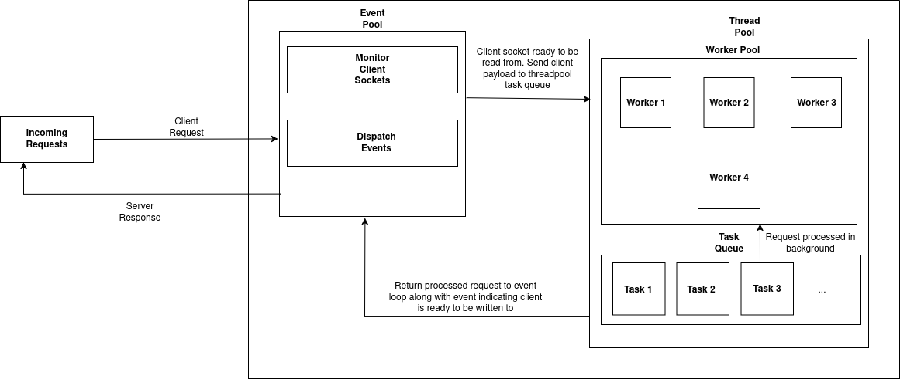

# http-server

# Table of Contents
- [About Project](#about-project)
  - [Concurrency Model](#concurrency-model)
- [Installation](#installation)
  - [Makefile](#makefile)
- [How to Deploy A Static Site](#how-to-deploy-a-static-site)
- [Future Plans](#future-plans)


## About Project
An experimental web server aptly named Cerver. This is just a fun little project and the server is in no way production ready. However, feel free to mess around with it in your own local environment (Linux only).

### Concurrent Model
Cerver takes a hybrid approach with regards to handling concurrent requests. It runs an event loop which monitors all incoming requests. These requests are then processed by background threads utilized by this event loop. An image of the concurrency model can be found below.



## Installation
### Makefile
Ensure you have C and GCC installed. 

Then, run the following command
```bash
sudo make install

# or
sudo make dev
```

You should be met with the following screen after visiting http://localhost:3000 in your browser


## How to Deploy A Static Site
Once installed, you can find the configuration json file in the following path: /etc/cerver/conf/cerver.json

It should contain the following contents
```json
{
    "num_of_threads": 4,
    "servers": [
        {
            "port": 3000,
            "server_name": "localhost",
            "location": {
                "path": "/",
                "root": "/var/www/cerver/html",
                "index": "index.html",
                "error_pages": "/var/www/cerver/html/error_pages"
            }
        }
    ]
}
```

The following are parameters that can be set:
- num_of_threads: How many threads the thread pool should contain
- server: This block contains information about your application
  - port: What port the app should run on. Default port is 3000
  - server_name: The domain to your app.
  - location: Block contains information about root path and site pages
    - path: root url
    - root: path to your web pages
    - index: index page
    - error_pages: path to your app's error pages

## Future Plans
I plan on adding the following in the near to medium term:
- HTTP2 Support
- Websocket Support
- Reverse Proxy
- Caching and Compression
- Serving multiple applications
- A proper installation script
- TLS Support
- Running the server as a service
- Validation for xml data

Feel free to contribute to this project if it's worth your time.